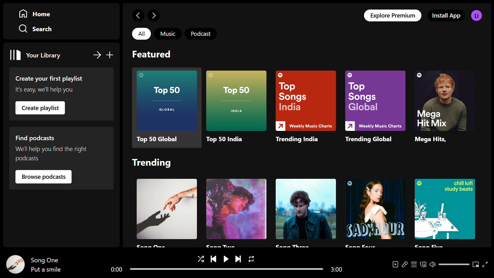
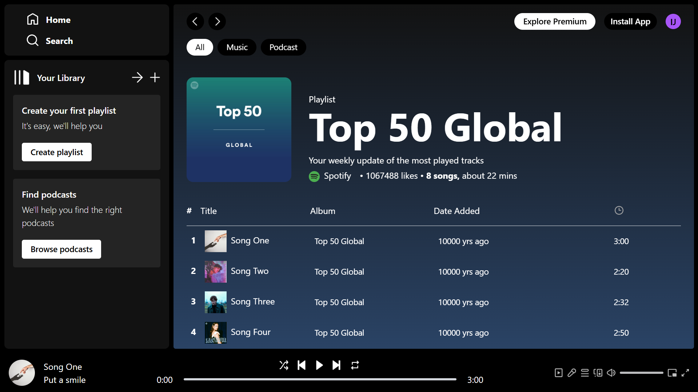

# 🎵 Spotify Clone

A sleek and responsive web application that recreates the core functionality and aesthetic of Spotify's music streaming service.



## 📖 Description

This Spotify Clone is a React-based web application that replicates the look and feel of the popular music streaming service. It allows users to browse albums, play songs, and navigate through a user-friendly interface closely resembling Spotify's design. Built with modern front-end technologies, it demonstrates a practical implementation of state management, responsive design, and audio playback functionality.

## 🛠️ Code Structure

```
spotify-clone/
├── public/               # Public assets and index.html
├── src/
│   ├── assets/           # Images, icons, and media files
│   ├── components/       # React components
│   │   ├── AlbumItem.jsx # Individual album display component
│   │   ├── Display.jsx   # Main display container component
│   │   ├── DisplayAlbum.jsx # Album view component
│   │   ├── DisplayHome.jsx # Home view component
│   │   ├── Navbar.jsx    # Navigation bar component
│   │   ├── Player.jsx    # Audio player component
│   │   ├── Sidebar.jsx   # Side navigation component
│   │   └── SongItem.jsx  # Individual song display component
│   ├── context/
│   │   └── PlayerContext.jsx # Context for music player state management
│   ├── App.jsx           # Main application component
│   ├── index.css         # Global styles
│   └── main.jsx          # Application entry point
├── .gitignore            # Git ignore configuration
├── index.html            # HTML entry point
├── package.json          # Project dependencies and scripts
├── tailwind.config.js    # Tailwind CSS configuration
└── vite.config.js        # Vite build configuration
```

## ✨ Features

- **Browse Albums**: View and navigate through featured albums
- **Music Playback**: Play, pause, skip tracks, and control playback progress
- **Responsive Design**: Fully responsive layout that adapts to different screen sizes
- **Album Details**: View detailed information about albums including tracks and duration
- **Interactive UI**: Hover effects and interactive elements that mimic Spotify's interface
- **Audio Controls**: Play/pause, next/previous, and seek functionality
- **Dynamic Theming**: Album background colors adapt based on selected album

## 💻 Tech Stack

- **React** (v19.0.0) - Frontend framework
- **React Router** (v7.5.1) - Navigation and routing
- **TailwindCSS** (v3.4.17) - Utility-first CSS framework
- **Vite** (v6.3.1) - Build tool and development server
- **Context API** - State management
- **HTML5 Audio API** - Audio playback functionality

## 🚀 Setup Instructions

1. **Clone the repository**
   ```bash
   git clone https://github.com/IamInvictus-Jai/Spotify-Clone.git
   cd Spotify-Clone
   ```

2. **Install dependencies**
   ```bash
   npm install
   ```

3. **Run the development server**
   ```bash
   npm run dev
   ```

4. **Build for production**
   ```bash
   npm run build
   ```

5. **Preview the production build**
   ```bash
   npm run preview
   ```

## 🌐 Deployment

### Deployment Platform
This application is deployed on [Vercel](https://vercel.com), a platform optimized for frontend frameworks like React.

### Deployment Link
Visit the live application: [spotify-clone.vercel.app](spotify-clone-one-swart-87.vercel.app)

## 📱 Screenshots

<div style="display: flex; gap: 10px; flex-wrap: wrap; justify-content: center;">
  
  
  
</div>

## 📞 Contact Information

- **Developer**: Pulasari Jai
- **Email**: prof.techinvictus@gmail.com
- **GitHub**: [github.com/IamInvictus-Jai]
- **LinkedIn**: [https://www.linkedin.com/in/pulasari-jai-11b34b346]

## 📄 License

This project is licensed under the MIT License - see the LICENSE file for details.

---

Feel free to contribute to this project by submitting issues or pull requests!